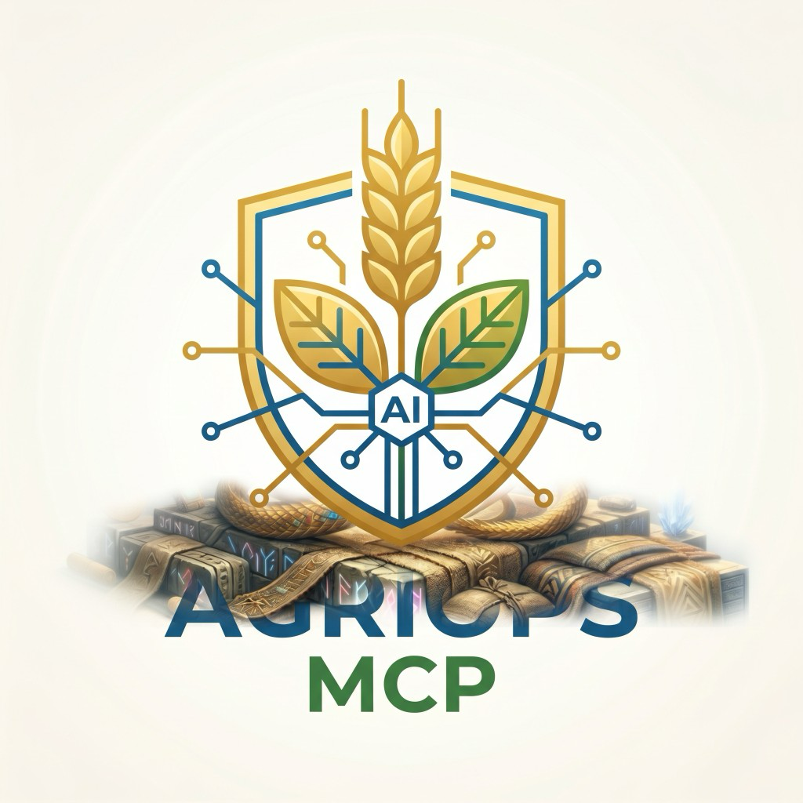
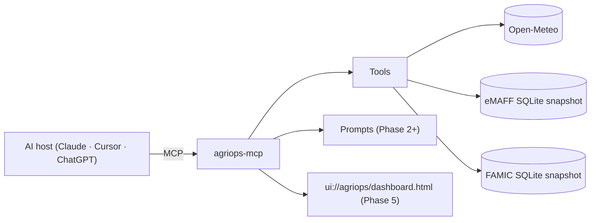

# AgriOps MCP

<p align="center">
  
</p>

[](https://github.com/WIN-kagoshima/agriops-mcp/actions/workflows/ci.yml)
[](https://github.com/WIN-kagoshima/agriops-mcp/actions/workflows/codeql.yml)
[](https://securityscorecards.dev/viewer/?uri=github.com/WIN-kagoshima/agriops-mcp)
[](https://www.npmjs.com/package/@sugukuru/agriops-mcp)
[](LICENSE)
[](https://nodejs.org/)
[](https://modelcontextprotocol.io/specification/2025-11-25/)
[](https://github.com/modelcontextprotocol/ext-apps)

> **Reference implementation** of an MCP server using MCP Spec 2025-11-25, MCP Apps Extension 2026-01-26, and the official MCP TypeScript SDK v1.x.
> Apache-2.0 · TypeScript ESM · Node.js 22+ · stdio + Streamable HTTP.
>
> 日本語: [README.ja.md](./README.ja.md)

AgriOps MCP exposes Japanese agricultural data — farmland polygons (eMAFF), 1 km mesh weather (Open-Meteo, JMA), and pesticide registrations (FAMIC) — to AI agents through MCP. The audience is staffing companies that dispatch Specified Skilled Workers (特定技能 / SSW) to farms.

## Demo

<!-- TODO(maintainer): replace with a real ≤30s screen recording GIF from Claude Desktop showing: "search farmland in Kagoshima" → weather check → pesticide lookup → open_dashboard. See docs/articles/show-hn-draft.md for the narrative this should follow. -->

30-second flow this should show once recorded: ask a connected agent to find farmland in a Japanese city → check the week's weather for it → confirm a pesticide's registration for the registered crop → open the strategic dashboard (`ui://agriops/dashboard.html`) for a visual summary. Try it yourself right now:

```bash
npx -y @sugukuru/agriops-mcp --stdio
```

Deep-dive articles: [7 MCP primitives design record (JA, Zenn)](docs/articles/zenn-mcp-7-primitives.ja.md) · [English adaptation (dev.to)](docs/articles/devto-mcp-7-primitives.en.md).

## Status

**Stable since `1.0.0`**. Tool names, prompt names, resource URIs, and input/output schemas are frozen under SemVer. Breaking changes require a `2.0.0`. See [CHANGELOG.md](./CHANGELOG.md).

| Phase | Version | Capabilities |
|---|---|---|
| 0 | `0.1.0` | stdio transport · `get_weather_1km` |
| 1 | `0.1.x` | + Streamable HTTP · Server Card · `search_farmland`, `area_summary`, `nearby_farms`, `get_pesticide_rules` |
| 2 | `0.2.x` | + 5 user-controlled prompts (slash commands) |
| 3 | `0.3.x` | + Elicitation Form mode |
| 4 | `0.4.x` | + Elicitation URL mode + OAuth Client Credentials |
| 5 | `0.5.x` | + MCP Apps UI dashboard (map + weather overlay) |
| 6–9 | `1.x` | + crop calendar · market price · SSW compatibility · labor shortage stats · livestock stats |
| 10 | `1.10.0` | + 戦略室 UI 2.0: municipality drill-down · 8 adaptive viz · viz_hint protocol · TopoJSON resources |

## Capabilities at a glance



## Quickstart (stdio)

Requires **Node.js 22 LTS** and npm (pnpm/yarn also work). The repo includes a `.nvmrc` for nvm/fnm users.

> **Windows / OneDrive users:** `better-sqlite3` ships prebuilt binaries for Node 22 LTS — no C++ compiler needed. Use Node 22 and pause OneDrive sync (or clone outside OneDrive) before running `npm ci` to avoid EPERM errors. See [CONTRIBUTING.md](./CONTRIBUTING.md) for details.

```bash
git clone https://github.com/WIN-kagoshima/agriops-mcp.git
cd agriops-mcp
npm ci
npm run build
npm run dev   # starts stdio transport
```

### Claude Desktop / Claude Code

Add to `~/Library/Application Support/Claude/claude_desktop_config.json` (macOS) or `%APPDATA%\Claude\claude_desktop_config.json` (Windows):

```json
{
  "mcpServers": {
    "agriops-mcp": {
      "command": "node",
      "args": ["/absolute/path/to/agriops-mcp/dist/server.js", "--stdio"]
    }
  }
}
```

### Cursor

Settings → MCP → Add MCP server:

```json
{
  "name": "agriops-mcp",
  "command": "node",
  "args": ["/absolute/path/to/agriops-mcp/dist/server.js", "--stdio"]
}
```

### MCP Inspector

```bash
npm run inspector
```

## Quickstart (Streamable HTTP, Phase 1+)

```bash
npm run build
npm run start:http      # listens on $PORT (default 3001)
```

The server exposes:

- `POST /mcp` — JSON-RPC over Streamable HTTP (per MCP Spec 2025-11-25).
- `GET /mcp` — server-initiated SSE notifications.
- `DELETE /mcp` — explicit session termination.
- `GET /.well-known/mcp-server.json` — Server Card for registries.
- `GET /healthz` — liveness probe (503 while draining).
- `GET /readyz` — readiness probe with per-adapter status.
- `GET /metrics` — Prometheus exposition (bearer-token gated when `AGRIOPS_METRICS_BEARER` is set).

Production deployment, key rotation, incident response, and SLO targets are documented in [`docs/runbook.md`](docs/runbook.md). Metrics, log format, rate limiting, and alerting recommendations are in [`docs/observability.md`](docs/observability.md). For system design and the adapter/tool/phase model, see [`docs/architecture.md`](docs/architecture.md).

### Deployed reference endpoints

Two Cloud Run deployments exist. Both run the same unmodified server image; only IAM and env vars differ.

**Operational (IAM-protected):**

```text
https://agriops-mcp-n5vdix22hq-an.a.run.app
```

**Public (anonymous, default 8-tool surface, for MCP registries / Anthropic Connectors Directory):**

```text
https://agriops-mcp-public-731026511067.asia-northeast1.run.app
```

A dedicated `agriops-mcp-public` Cloud Run service in the `mcp-service-492010` project, built from
[`cloudbuild.public.yaml`](cloudbuild.public.yaml) and [`.github/workflows/deploy-public.yml`](.github/workflows/deploy-public.yml),
documented in [`docs/anthropic-directory-submission.md`](docs/anthropic-directory-submission.md). It
never enables `AGRIOPS_ENABLE_EXTENDED_TOOLS` / `AGRIOPS_ENABLE_LEGACY_TOOLS` and applies the same rate
limiting and Host/Origin allowlisting as the operational deployment. Its eMAFF/FAMIC snapshots are real
data reproducibly built from the official public sources (筆ポリゴン公開サイト FlatGeobuf export, FAMIC
CSV export) — see [`snapshots/README.md`](snapshots/README.md) — not the unit-test fixtures. Verify it
anonymously with:

```bash
npm run deploy:smoke -- \
  --base-url=https://agriops-mcp-public-731026511067.asia-northeast1.run.app \
  --health-path=/livez \
  --expected-version="$(node -p "require('./package.json').version")"
```

Operators can verify the IAM-protected deployment with:

```bash
TOKEN="$(gcloud auth print-identity-token)"
npm run deploy:smoke -- \
  --base-url=https://agriops-mcp-n5vdix22hq-an.a.run.app \
  --health-path=/livez \
  --expected-version="$(node -p "require('./package.json').version")" \
  --auth-bearer="$TOKEN"
```

The smoke test checks `/livez`, `/readyz`, the Server Card, MCP `initialize`,
`tools/list`, `prompts/list`, and `resources/list`.

## Tools

**Default surface — 8 core tools.** This is what a fresh connection, the MCP Inspector, or an Anthropic Connectors Directory reviewer sees; no env vars required.

| Name | Phase | Side effect | Summary |
|---|---|---|---|
| `get_weather_1km` | 0 | read-only | Hourly forecast at the given lat/lng (up to 7 days). Open-Meteo with ET₀, soil moisture, soil temperature. |
| `get_weather_warning` | 1 | read-only | JMA active 警報・注意報 by prefecture. Cached ≤ 10 min. |
| `search_farmland` | 1 | read-only | Search eMAFF Fude polygons by address, prefecture, or crop. |
| `area_summary` | 1 | read-only | Aggregate farmland statistics over a polygon or admin code. |
| `nearby_farms` | 1 | read-only | Farmland within a radius of a centroid. |
| `get_pesticide_rules` | 1 | read-only | FAMIC pesticide registrations applicable to a crop / pest. |
| `create_staff_deploy_plan` | 3 | draft | Generates a non-binding staff deployment plan. Uses Form elicitation when input is missing. |
| `open_dashboard` | 5 | read-only (UI) | Opens the MCP Apps UI dashboard. Falls back to a structured summary on hosts without MCP Apps. |

**Extended tools** (`AGRIOPS_ENABLE_EXTENDED_TOOLS=true`) — real product features, opt-in by default since `1.12.0` to keep the default surface lean: the Tasks Primitive (`create_task`, `get_task_status`), `snapshot_status`, and derived agronomy tools (`crop_calendar`, `field_weather_report`, `spray_window`, `multi_field_compare`, `seasonal_risk_forecast`, `optimize_harvest_timing`), plus the Phase 12 Precision Ag/IoT layer.

**Legacy tools** (`AGRIOPS_ENABLE_LEGACY_TOOLS=true`) — the seven tools already marked `deprecated: true` (market price, prefecture crop profile, SSW compatibility, labor/livestock stats, municipality stats, e-Stat).

No tool was renamed or removed by this change — see [`docs/anthropic-directory-submission.md`](docs/anthropic-directory-submission.md) for the rationale. Full tool inventory, app-only (UI-driven) tools, and low-level helpers are documented in [docs/api-reference.md](docs/api-reference.md).

### Client examples

Three runnable clients in [`examples/`](examples) — TypeScript stdio, Python (`mcp[cli]`) stdio, and `curl` over Streamable HTTP — that all call `get_weather_1km` against this server.

## Prompts (Phase 2+)

User-controlled slash commands. The MCP host decides when to surface them; the LLM does not auto-fire them.

| Slash command | Required args | Since |
|---|---|---|
| `/field_summary` | `field_id` | 1.0.0 |
| `/pesticide_advice` | `crop`, `pest_or_disease` | 1.0.0 |
| `/staff_deploy_plan` | `farm_ids[]`, `period` | 1.0.0 |
| `/area_briefing` | `prefecture` | 1.1.0 |
| `/weather_risk_alert` | `farm_ids[]` | 1.1.0 |
| `/irrigation_schedule` | `lat`, `lng` | 1.3.0 |
| `/data_freshness_check` | *(none)* | 1.3.0 |
| `/harvest_readiness` | `crop`, `lat`, `lng`, `last_spray_date` | 1.4.0 |
| `/daily_briefing` | `lat`, `lng` | 1.5.0 |
| `/field_visit_checklist` | `field_id` | 1.5.0 |

## Performance

End-to-end `tools/call` latency for the two most request-heavy core tools, measured over an in-memory MCP transport against deterministic mock adapters (no network/filesystem I/O — isolates MCP + Zod validation overhead from upstream API latency):

| Tool | p50 (ms) | p95 (ms) | p99 (ms) | ops/sec |
|---|---|---|---|---|
| `search_farmland` | 0.042 | 0.057 | 0.123 | ~22,800 |
| `get_weather_1km` | 0.042 | 0.055 | 0.116 | ~22,800 |

Node v24, darwin/arm64, [tinybench](https://github.com/tinylibs/tinybench). Reproduce with `npm run bench` ([`scripts/bench.ts`](scripts/bench.ts)); real-world latency is dominated by the upstream Open-Meteo/eMAFF/FAMIC calls this overhead sits in front of, not by this server.

## Data sources & licensing

This server only ships data sources that are open or whose licenses permit redistribution under documented constraints. See [docs/data-license.md](docs/data-license.md) for the full table.

| Source | License | Notes |
|---|---|---|
| eMAFF Fude Polygon | Public open data | SQLite snapshot built locally; not redistributed in npm package. |
| Open-Meteo | CC-BY 4.0 | Live API. Attribution included in tool output. |
| FAMIC pesticide | Public open data | SQLite snapshot built locally. |
| JMA disaster XML | Japan Meteorological Business Act | Phase 1+, short cache only. |
| WAGRI | Member agreement | **Out of scope for this OSS release** (Phase 7+, separate package). |

Cloud Next '26 agent-readiness notes for Agent Platform, Smart Storage,
Fraud Defense, and multi-AI security are tracked in
[`docs/cloud-next26-agent-readiness.md`](docs/cloud-next26-agent-readiness.md).
Reverse-proxy / Agent Gateway deployment guidance lives in
[`docs/agent-gateway-deployment.md`](docs/agent-gateway-deployment.md).

**Maintainers — publishing `@sugukuru/agriops-mcp` to npm:** first-time and CI setup is documented in [`docs/npm-first-publish.md`](docs/npm-first-publish.md).

## Security & Privacy

- No secrets in tool output, logs, errors, or UI bundles.
- DNS rebinding protection enabled on Streamable HTTP transport.
- Origin / Host allowlist on HTTP transport.
- See [SECURITY.md](./SECURITY.md) for vulnerability reporting and [docs/privacy-policy.md](docs/privacy-policy.md) for what data this server processes and retains.
- Public HTTPS copies (日本語 / English / Bahasa Indonesia) are published via GitHub Pages: [Privacy Policy](https://win-kagoshima.github.io/agriops-mcp/privacy-policy/) · [Support](https://win-kagoshima.github.io/agriops-mcp/support/) · [Data License](https://win-kagoshima.github.io/agriops-mcp/data-license/).

## Roadmap

- Anthropic Connectors Directory listing (see [docs/anthropic-directory-submission.md](docs/anthropic-directory-submission.md) for current status).
- Phase 6+: a `tasks` primitive for long-running agronomy jobs, once the official spec capability is stable enough to declare truthfully.
- Next step under evaluation: connecting AgriOps' farmland/weather/pesticide lookups to Sugukuru's internal placement (`aios`) and visa-status (`SuguVisa`) systems, so a placement decision and its SSW visa-deadline implications can be checked in one conversation.

## Contributing

See [CONTRIBUTING.md](./CONTRIBUTING.md). All contributions must be Apache-2.0 compatible.

## License

Apache-2.0. © 2026 WIN Kagoshima
