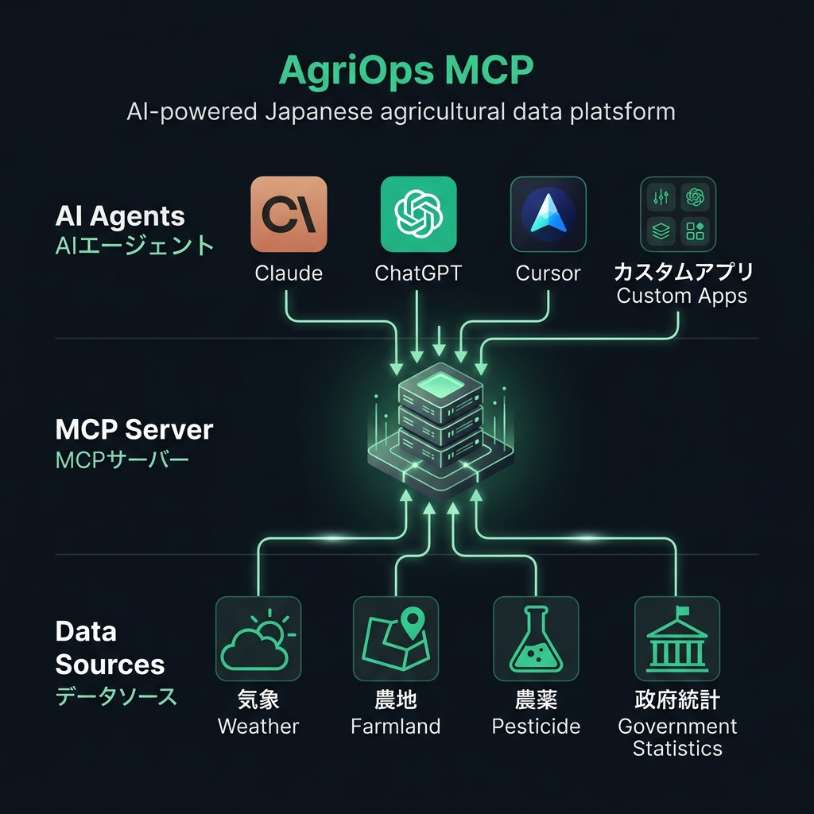
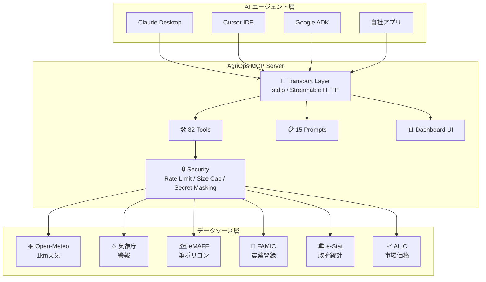
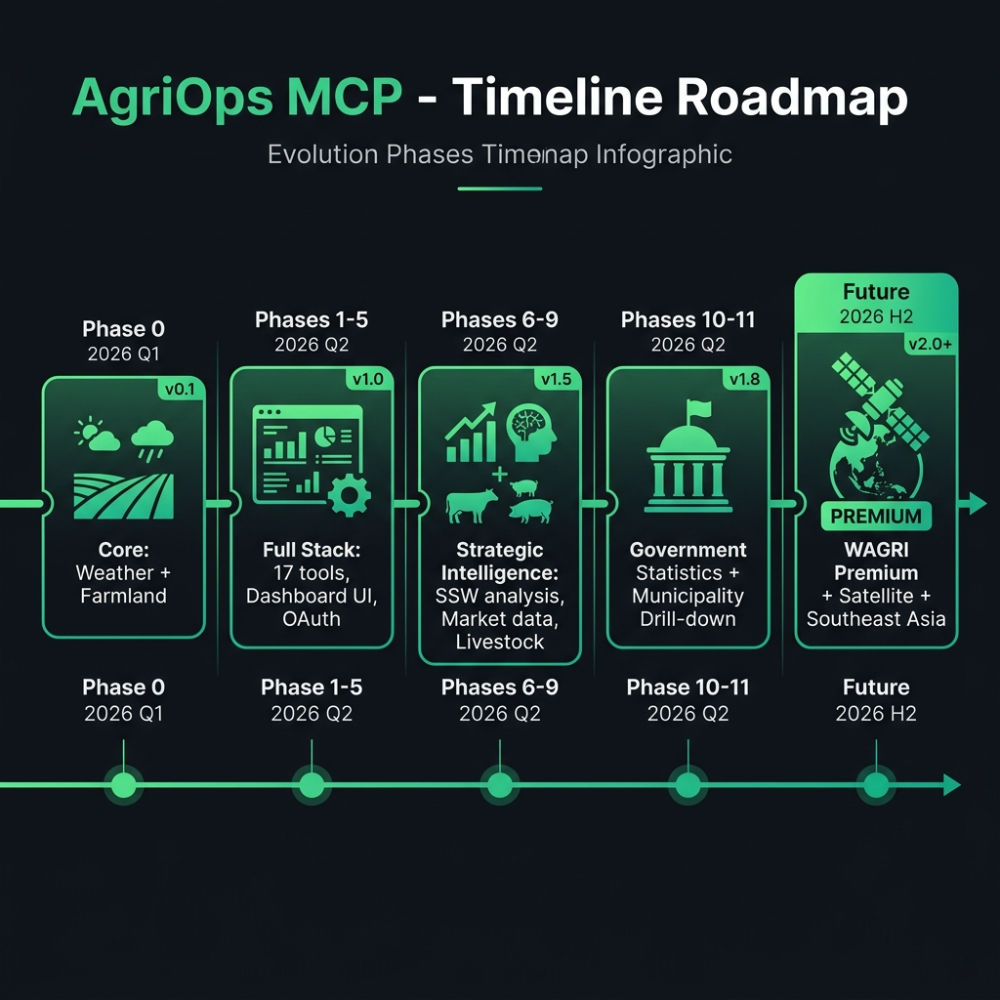

# 🌾 AgriOps MCP — 日本の農業を AI で変える

> **AI エージェントが日本の農業データに直接アクセスできる、唯一のオープンソース基盤**
> 
> Version 1.14.2 | 2026年7月 | Apache-2.0 License

---

## 1. ひとことで言うと何？

AgriOps MCP は、**AI に「日本の農業の知識」を与えるサーバー** です。

普通の AI は、農業のことを聞かれても「一般的な知識」でしか答えられません。
AgriOps MCP を接続すると、AI は **リアルタイムの天気・農地・農薬・市場価格・政府統計** を自分で調べて、根拠のある回答ができるようになります。

> 💡 **たとえ話**: AI にとっての「農業の目と耳」を作った — それが AgriOps MCP です。



---

## 2. なぜこれが必要なのか？ — 日本農業の3つの危機

### 🔴 危機 1: 農業就業者の急減
- 2020年の農業従事者は **136万人**（5年で22%減少）
- 平均年齢 **67.8歳**、65歳以上が **70%**
- **あと10年で半数がリタイア** する

### 🔴 危機 2: 知識の属人化
- 「いつ種を撒くか」「いつ農薬を撒くか」がベテランの勘に依存
- ベテランの引退 = ノウハウの消失
- JA の営農指導員も 4 つのサイトを手動で巡回して情報収集（1件30分）

### 🔴 危機 3: 外国人労働者の活用が進まない
- 特定技能(SSW)外国人の農業受け入れは拡大中だが、**「どの作物に」「どの地域に」配置すべきか** の判断が経験則頼み
- 作物ごとの人手不足度・市場価値・季節変動を統合的に分析できるツールがない

### ✅ AgriOps MCP の解決策

| 危機 | AgriOps の回答 |
|------|--------------|
| 農業就業者の急減 | AI が農業知識の「デジタルツイン」になる |
| 知識の属人化 | 天気×農薬×作期の判断を根拠付きで自動化 |
| 外国人労働者の配置 | SSW 戦略分析ツールで最適配置を提案 |

---

## 3. 何ができるのか？ — 機能マップ

### 🛠️ 32 個のツール（AI が使える「手」）

````carousel
### 🌤️ 天気・気象（4ツール）

| ツール | できること |
|--------|----------|
| `get_weather_1km` | 任意の緯度経度の **1km メッシュ天気予報** — 気温・降水・風速・湿度・蒸発散量・土壌水分 |
| `get_weather_warning` | 気象庁の **警報・注意報** をリアルタイム取得 |
| `fetch_weather_layer` | ダッシュボード用の気象レイヤーデータ |
| `seasonal_risk_forecast` | 7日間の **農業リスク予報** — 高温・霜・大雨・干ばつ・強風・病害虫 |

<!-- slide -->

### 🗺️ 農地・圃場（6ツール）

| ツール | できること |
|--------|----------|
| `search_farmland` | eMAFF 筆ポリゴンから **農地を検索** — 都道府県・市町村・作物で絞り込み |
| `area_summary` | 地域の **農地集計** — 面積・筆数・主要作物 |
| `nearby_farms` | 指定地点の **近隣農地** を検索 |
| `field_weather_report` | 圃場 ID 一つで **天気×警報の統合レポート** |
| `multi_field_compare` | 最大10圃場の **横並び比較** — 今日どこで作業すべきか判定 |

<!-- slide -->

### 💊 農薬・作物（4ツール）

| ツール | できること |
|--------|----------|
| `get_pesticide_rules` | FAMIC 登録に基づく **農薬の適用ルール** — 希釈倍率・安全使用期間 |
| `crop_calendar` | **17作物**の月別農作業カレンダー（9気候区対応） |
| `spray_window` | 風速・降水・湿度から **農薬散布の最適時間帯** を判定 |
| `optimize_harvest_timing` | 天気×市場価格×労働力から **最適収穫月** を提案 |

<!-- slide -->

### 📊 戦略分析（6ツール）

| ツール | できること |
|--------|----------|
| `get_market_price` | **19 品目**の卸売参考価格 + 季節変動率 |
| `get_prefecture_crop_profile` | **19 都道府県**の作物プロファイル |
| `get_ssw_crop_compatibility` | 作物ごとの **SSW（特定技能）適合スコア** |
| `get_labor_shortage_stats` | 都道府県別 **農業労働力不足度** |
| `get_livestock_regional_stats` | **畜産統計** — ブロイラー・養豚・酪農・肉用牛 |
| `get_municipality_stats` | **市町村レベル**の農業統計 |

<!-- slide -->

### 🏛️ 政府統計（1ツール — NEW!）

| ツール | できること |
|--------|----------|
| `get_estat_stats` | **e-Stat（政府統計の総合窓口）API** に直接アクセス — 農林業センサス・作物統計・畜産統計をリアルタイム取得 |

### 📋 プロンプト（15個）+ ダッシュボード UI

- **朝のブリーフィング**、**圃場訪問チェックリスト**、**市場トレンド分析**
- **SSW 戦略ブリーフィング**、**年間配置計画** など
- **戦略室ダッシュボード** — 地図・レーダーチャート・時系列グラフ・ヒートマップの 8 種ビジュアライゼーション
````

---

## 4. 誰のために？ — ターゲット

### 🎯 主要ターゲット（4つのペルソナ）

````carousel
### 👔 田中 誠一（55歳）— 農業派遣マネージャー

**「30人のスタッフを毎日10〜20の圃場に配置する」**

| 今の悩み | AgriOps で解決 |
|---------|--------------|
| 朝5時に起きて天気→圃場→電話の3ステップ | `daily_briefing` で全圃場のリスクが1画面に |
| 雨の判断に30分 | `multi_field_compare` で「今日はこの圃場」が即判定 |
| 散布日と収穫日の間隔を手計算 | `spray_window` が安全時間帯を自動判定 |

<!-- slide -->

### 👩‍🌾 山本 あゆみ（32歳）— JA 営農指導員

**「80戸の農家を週15件訪問して助言する」**

| 今の悩み | AgriOps で解決 |
|---------|--------------|
| 訪問前に4サイトを巡回（30分/件） | `field_visit_checklist` で圃場ID一つから全情報生成 |
| 「この農薬使えますか？」に即答できない | `pesticide_advice` で FAMIC 登録に基づく即答 |
| 収穫適期の助言が経験頼み | `harvest_readiness` で天気＋安全期間の両面判定 |

<!-- slide -->

### 🌾 鮫島 隼人（42歳）— さつまいも農家

**「3haのさつまいも＋茶を家族経営」**

| 今の悩み | AgriOps で解決 |
|---------|--------------|
| 灌水の判断が勘 | `irrigation_schedule` で蒸発散量に基づく具体指示 |
| 農薬散布で近隣トラブル | `spray_window` で風速根拠の散布タイミング |
| ブランド価値に直結する収穫時期の根拠が弱い | `optimize_harvest_timing` で天気×市場の最適解 |

<!-- slide -->

### 💻 佐藤 リナ（28歳）— AgriTech CTO

**「農業 DX アプリに AI 機能を組み込みたい」**

| 今の悩み | AgriOps で解決 |
|---------|--------------|
| 4つのデータソース統合に2ヶ月 | MCP の URL 1 つ繋ぐだけで全データ基盤 |
| MCP 対応にリソースが割けない | 完全 MCP Spec 準拠の参照実装 |
| AI アドバイスのプロンプト設計ノウハウがない | 15 個のプロンプトが即使える |
````

---

## 5. どう作ったのか？ — 構築の 8 つのポイント

### 🏗️ アーキテクチャの設計思想



### 📌 8 つの構築ポイント

| # | ポイント | なぜ重要か |
|---|---------|----------|
| ① | **MCP 仕様 100% 準拠** | Claude・Cursor・ChatGPT どれでも動く。ベンダーロックインなし |
| ② | **アダプターパターン（DI 設計）** | データソースごとに独立。追加・差し替えが容易。テストでモック可能 |
| ③ | **条件付きツール登録** | API キー未設定のツールは登録しない → LLM が混乱しない |
| ④ | **全レスポンスに Attribution** | データの出典を全結果に自動付与 → ライセンス準拠 + LLM が引用可能 |
| ⑤ | **多層セキュリティ** | 結果サイズ上限(1MiB)・レートリミット・秘密情報マスク・Red Team テスト 11 シナリオ |
| ⑥ | **Server Card 公開** | `/.well-known/mcp-server.json` で機能を自動発見 → レジストリ・クローラー対応 |
| ⑦ | **220 テスト / 42 ファイル** | ユニット + スモーク + 適合性 + シナリオ + Red Team — CI で全自動 |
| ⑧ | **段階的フェーズ開発** | Phase 0（天気のみ）→ Phase 11（政府統計）まで、常に動く状態を維持しながら機能追加 |

---

## 6. 競合との差別化

| 比較対象 | その強み | AgriOps が勝る点 |
|---------|---------|-----------------|
| ウェザーニュース for Business | 高精度天気 | AI エージェント直接統合。農薬×圃場×警報のクロス分析 |
| アグリノート（ウォーターセル） | 圃場管理 UI | **オープンソース + MCP 標準** → ベンダーロックインなし |
| KSAS（クボタ） | 機械連携 | 機械メーカー非依存。データポータビリティ |
| xarvio (BASF) | AI 病害虫予測 | 日本の FAMIC 登録データに直接アクセス。国内法規に完全準拠 |
| 農薬ナビ | 農薬検索 | MCP ツールとして **AI が自分で呼び出す** → 手動検索不要 |

> ### 🏆 唯一の差別化ポイント
> **「日本の農業データに特化した MCP サーバーは、世界でこれだけ」**

---

## 7. 未来のロードマップ



### Phase ロードマップ詳細

| Phase | バージョン | 時期 | 内容 |
|-------|----------|------|------|
| ✅ Phase 0–1 | v0.1–0.5 | 2026 Q1 | 天気・農地・農薬の基本5ツール + Server Card |
| ✅ Phase 2–5 | v0.5–1.0 | 2026 Q1–Q2 | プロンプト・認証・ダッシュボード UI・本番運用基盤 |
| ✅ Phase 6–9 | v1.4–1.9 | 2026 Q2 | 作物カレンダー・市場価格・SSW 戦略分析・畜産統計 |
| ✅ Phase 10–11 | v1.10–1.11 | 2026 Q2 | 市町村ドリルダウン・e-Stat 政府統計 API **← 今ここ** |
| 🔜 Phase 12 | v1.12+ | 2026 Q3 | WAGRI 連携（有料農業データ基盤）・衛星画像 NDVI |
| 🔮 Phase 2.0 | v2.0+ | 2026 H2 | 東南アジア農業への横展開・多言語化・自動スケジューリング AI |

### 🔮 3年後のビジョン

```
2026年（今）       →  2027年            →  2028年
━━━━━━━━━━━━━━━━━━━━━━━━━━━━━━━━━━━━━━━━━━━━━━━━
日本の農業データ基盤     アジアの農業AI基盤      グローバル農業AI基盤
・32ツール              ・50+ツール            ・100+ツール
・19都道府県            ・47都道府県+東南アジア  ・10カ国対応
・OSS無料提供           ・SaaS課金モデル        ・農業AIプラットフォーム
・個社利用              ・JA/自治体連携         ・政府・国際機関連携
```

---

## 8. 技術スペック

| 項目 | 値 |
|------|-----|
| 言語 | TypeScript (Node.js ≥22) |
| プロトコル | MCP Spec 2025-11-25 + MCP Apps 2026-01-26 |
| ライセンス | Apache-2.0 (商用利用自由) |
| テスト | 42 ファイル / 220 テスト |
| ツール数 | 32（うちモデル可視 17） |
| プロンプト | 15 |
| データソース | 6 (Open-Meteo, JMA, eMAFF, FAMIC, ALIC, e-Stat) |
| 対応クライアント | Claude Desktop, Cursor, Google ADK, ChatGPT (planned) |
| デプロイ先 | Cloud Run (Docker), ローカル, npm |
| パッケージ | `@sugukuru/agriops-mcp` |
| CI/CD | GitHub Actions (lint + typecheck + test + CodeQL + Scorecard) |

---

## 9. はじめかた（3ステップ）

```bash
# 1. インストール
npm install -g @sugukuru/agriops-mcp

# 2. 起動
agriops-mcp --http

# 3. AI に繋ぐ（Claude Desktop の場合）
#    設定ファイルに URL を追加するだけ
```

**それだけで、AI が日本の農業データを自由に使えるようになります。**

---

## 10. お問い合わせ

| 項目 | リンク |
|------|--------|
| 🏢 開発元 | 株式会社WIN |
| 📧 連絡先 | info@win-g-c.com |
| 🌐 GitHub | [WIN-kagoshima/agriops-mcp](https://github.com/WIN-kagoshima/agriops-mcp) |
| 📦 npm | [@sugukuru/agriops-mcp](https://www.npmjs.com/package/@sugukuru/agriops-mcp) |
| 📄 ライセンス | Apache-2.0 |

---

> *「農業の未来は、データとAIの力で耕す」*
> 
> — AgriOps MCP チーム
